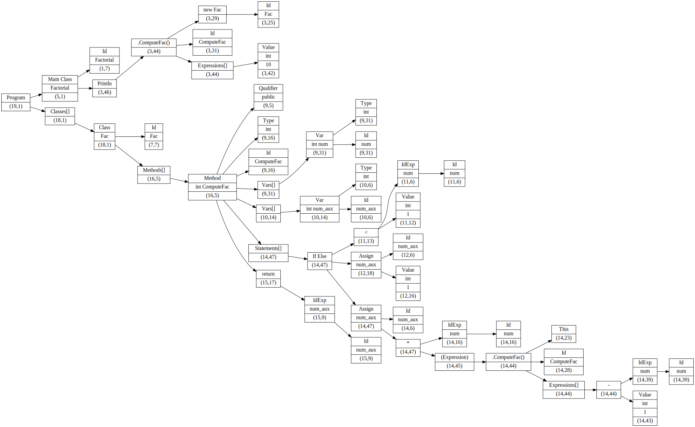
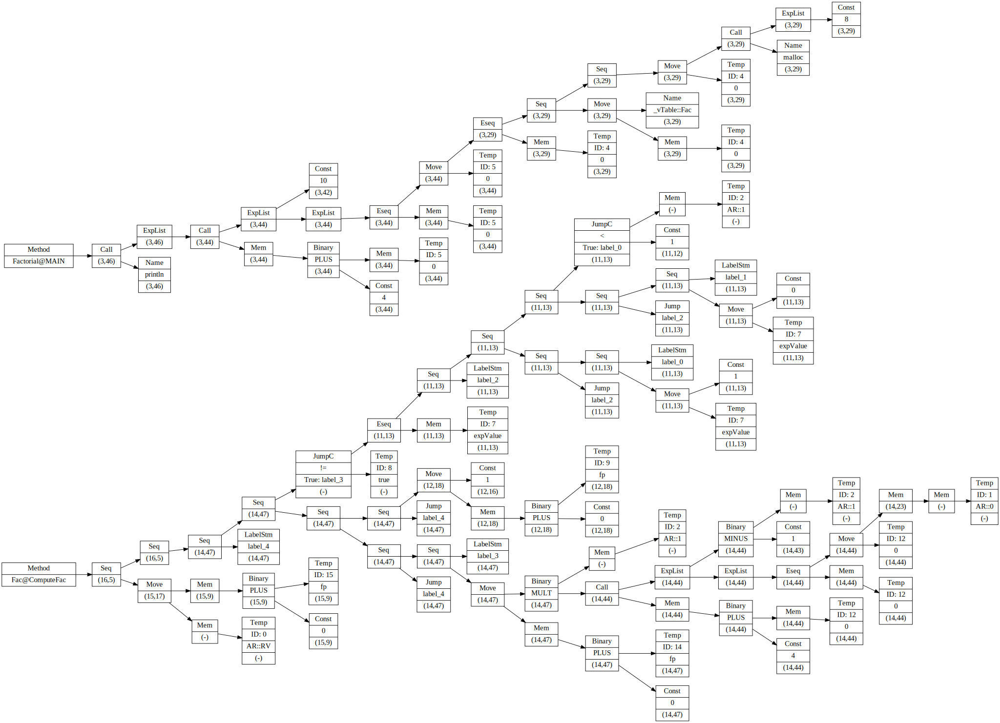

# shishkin_forest 
**shishkin_forest** - a compiler for MiniJava language  
#### Code  
```
class Factorial{
    public static void main(String[] a){
	    System.out.println(new Fac().ComputeFac(10));
    }
}
class Fac {
    public int ComputeFac(int num){
	    int num_aux ;
	    if (num < 1)
	      num_aux = 1 ;
	    else 
	      num_aux = num * (this.ComputeFac(num-1)) ;
	    return num_aux ;
    }
}
```

#### AST
  

#### IR  
  

### Requirements:
- gcc
- flex++
- bison
- GraphViz(dot)

### Usage:
```
./scripts/parseFile.sh <File> #Generate a syntax tree and save as svg-image
./scripts/listClasses.sh <File> #Display all classes, methods and their variables
./scripts/checkTypes.sh <File> #Run checks for syntax, declaration and type errors
./scripts/buildIR.sh <File> #Run checks, creates IR-tree and save as svg-image
```
---
Developed by [ElinRin](https://github.com/ElinRin) and [IKholopov](https://github.com/IKholopov) as part of ABBYY course in MIPT on compiler development, 2017-2018.
